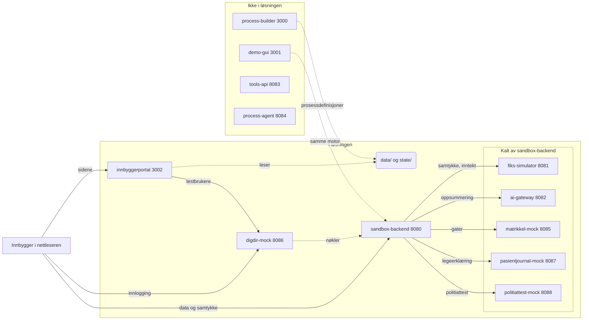

# Innbyggerportal

**For deg som vil se hvordan en kommunal «Min side» kan se ut når den bare får lov til
å vise det sandkassen faktisk har.** Én side på `:3002`, bygget på KS Digital sitt
designsystem, med profil, saksstatus, tjenester og kalender for den innbyggeren som er
logget inn.

Siden er en **demo av en flate**, ikke en tvungen klient. Skal du bygge din egen
frontend, hører den hjemme i ditt eget prosjekt mot de dokumenterte API-ene -
oppskriften står i [`docs/bygg-selv.md`](../../docs/bygg-selv.md).

## Tjenestene løsningen bruker

Åtte av sandkassens tolv tjenester er med når en innbygger logger inn, fyller ut et
skjema og sender det. Fire er ikke.



**Nettleseren snakker med tre av dem.** Portalen serverer bare sider og sitt eget
`/api/minside`; alt som er samtykkegatet går fra nettleseren rett til sandbox-backend
med innbyggerens eget ID-porten-token. Portalen har aldri tokenet, og kan derfor ikke
lese noe på innbyggerens vegne.

| Tjeneste | Hva den gjør her | Hvor i portalen |
| --- | --- | --- |
| `innbyggerportal` | Sidene, og `/api/minside` som leser `data/` og `state/` | Alle tre sidene |
| `digdir-mock` | ID-porten: velgeren, koden, tokenet. Og listen over hvem som kan logge inn | Innloggingen og forsiden |
| `sandbox-backend` | Prosesskatalogen, tilgangsoversikten, samtykkene, prosessøkten | «Hva du kan søke på» og skjemaet |
| `fiks-simulator` | Samtykkeraden skrives hit, og inntektsgrunnlaget beregnes her | Bryteren og inntektsblokken |
| `ai-gateway` | Oppsummeringen `SUMMARY`-steget lager før innsending | Send-knappen |
| `matrikkel-mock` | Gateoppslaget | Skjemaet for fartsdempende tiltak |
| `pasientjournal-mock` | Legeerklæringen | Skjemaet for TT-kort |
| `politiattest-mock` | Politiattesten, minimert | Skjemaet for politiattest |

De fire utenfor henger likevel sammen med løsningen: `process-builder` skriver
prosessdefinisjonene skjemaet tegnes fra, `demo-gui` er en annen flate på den samme
motoren, og `tools-api` og `process-agent` er agentveien inn - ingen av dem kalles av
portalen.

## Frontend og backend

Portalen er to ting som lett forveksles: en **sidetjener** og en **klient**. Tjeneren
på `:3002` serverer HTML og sidescript, og har én egen API-rute, `/api/minside`, som
leser `data/` og `state/` rett fra disken. Klienten er sidescriptene som kjører i
nettleseren, og de snakker med `sandbox-backend` på `:8080` **uten å gå via tjeneren**.

```
nettleser ──► innbyggerportal :3002   sider og /api/minside (leser disk)
    │
    └───────► sandbox-backend :8080   alt som er samtykkegatet, med token
```

**Hvorfor nettleseren kaller backend selv.** Tokenet er innbyggerens, utstedt til hen
av ID-porten. Portalen får det aldri. Et samtykkegatet oppslag blir dermed
autentisert som innbyggeren, havner i revisjonsloggen med hen som aktør, og avvises
når samtykket mangler. Hadde portalen stått i midten og hentet på vegne av
innbyggeren, måtte den hatt tokenet, og sporet ville pekt på portalen framfor på den
som faktisk ba om opplysningen.

**Derfor har Min side to kilder på én side:**

| Kort | Hvor det kommer fra | Trenger token |
| --- | --- | --- |
| Aktuelt for deg, profil, sak, tjenester, kalender | `/api/minside` i portalen, lest fra disk | Nei |
| Hva du kan søke på | `sandbox-backend`, med innbyggerens token | Ja |
| Søknadsskjemaet, inkludert innsending | `sandbox-backend`, med innbyggerens token | Ja |

Det er også hvorfor tilgangskortet feiler for seg selv: er backend nede, melder det
fra i sitt eget kort, og resten av siden står fordi den ble lest fra disk.

### Snarveien, og hva den koster

`/api/minside` er **ikke** autentisert, og den leser filer backend ville nektet å
utlevere uten samtykke:

```
GET :3002/api/minside/person-008              -> 200, med e-post og telefon i svaret
GET :8080/api/personer/person-008/kontaktinfo -> 401
```

| Filen portalen leser | Datakilden backend gater den som |
| --- | --- |
| `data/inntekter.json` | `inntekt` |
| `data/krr.json` | `kontaktinfo` |
| `data/legeerklaeringer.json` | `helseopplysninger` |
| `data/politiattester.json` | `politiattest` |

Samme opplysning, to dører, to forskjellige svar. I sandkassen er dataene syntetiske
og portene bundet til `127.0.0.1`, så dette lekker ingenting ekte. Men **mønsteret er
det motsatte av det sandkassen ellers lærer bort**, og AGENTS.md er tydelig på at
sperrer og samtykke håndheves i backend: frontenden viser tilstanden, den lager den
ikke.

Skal portalen bli mer enn en demo, er det to veier ut, og valget er ikke tatt:

1. **Flytt de gatede kortene over på backend.** Kalenderen og kontaktblokken hentes da
   med token som resten, og forsvinner når samtykket mangler - slik de skal.
2. **La `/api/minside` kreve token og sjekke samtykke selv.** Da får sandkassen to
   implementasjoner av den samme porten, og det er nettopp det `apps/shared/` finnes
   for å unngå.

Den første er den riktige. Den er ikke gjort fordi kortene ble skrevet før
tilgangskortet fantes, og fordi en side som leser fra disk virker uten at hele stakken
kjører - som er en ekte fordel på et hackathon, og en dårlig unnskyldning etterpå.

### Ingen delte typer

Klienten erklærer formene fra backend på nytt, lokalt: `Tilgangsstatus` og
`TilgangPerCase` i `src/client/minside.ts`, `Prosess`, `Steg` og `Felt` i
`src/client/soknad.ts`. `minside.ts` bruker på sin side den globale `Prosess` fra
`felles.ts`, så delingen er ikke konsekvent. Det lokale er med vilje. Tjenestene her
snakker HTTP og deler ikke interne biblioteker, så en `import` fra `sandbox-backend`
ville gjort en frontend til en kompileringsavhengighet av en tjeneste den bare kaller.

Wire-formatet er frosset, så feltnavnene kan ikke gli fra hverandre i stillhet. Det
som kan gli, er dekningen: en ny status eller en ny felttype i backend blir ikke en
kompileringsfeil her, den blir en tom rute i grensesnittet. `TILGANGSVISNING` er
derfor en `Record<Tilgangsstatus, ...>` - legges en status til i den lokale unionen,
krever kompilatoren en visning for den.

## Hva den viser

| Kort | Hva som står der | Hvor tallene kommer fra |
| --- | --- | --- |
| Aktuelt for deg | Karusellen øverst: frister som nærmer seg, søknader hos saksbehandler, ulest post, og plasser husstanden betaler for uten å ha søkt om ordningen | `data/satser.json`, `state/oppgaver.json`, `state/forsendelser.json`, `data/prosessdefinisjoner.json` |
| Min profil | Navn, adresse, kommune, maskert fødselsnummer, husstand og fast eiendom | `data/personer.json`, `data/husstander.json`, `data/matrikkel.json`, `data/eierforhold.json` |
| Hva du kan søke på | Hver publiserte prosess med status: innvilget, avslått, til behandling, krever samtykke, ikke aktuell eller kan søkes nå, og en bryter for samtykket raden trenger | `GET /api/personer/{personId}/tilganger` i sandbox-backend |
| Pågående sak | Søknaden eller den påbegynte prosessen, med stegene fra prosessdefinisjonen | `state/soknader.json`, `state/oppgaver.json`, `state/prosessoekter.json`, `data/prosessdefinisjoner.json` |
| Tjenester | Fem snarveier som folder seg ut med det innbyggeren faktisk har | `state/forsendelser.json`, `data/eierforhold.json`, `data/barnehageplasser.json`, `data/sfoplasser.json`, `data/fritidsdeltakelse.json`, `data/tjenestetilbud.json` |
| Kalender | Frister og datoer som allerede står i dataene | `data/satser.json`, `state/samtykker.json`, `data/inntekter.json`, `data/legeerklaeringer.json`, `data/politiattester.json`, `data/krr.json` |

Hvert kort skriver kilden sin nederst, så et tall på skjermen kan følges tilbake til
raden det står i.

**«Aktuelt for deg» utløses av fakta, ikke av vurderinger.** At husstanden har en
barnehageplass og ingen søknad om redusert foreldrebetaling sier at søknaden ikke er
sendt, ikke at den ville blitt innvilget. Den vurderingen hører i backend, og teksten i
påminnelsen sier det. Vil du se hva reglene faktisk svarer, står det i kortet under -
«Hva du kan søke på» kjører dem.

## Kommunen følger innbyggeren

Det er ingen kommune innstilt noe sted. `kommuneFor()` i `src/minside.ts` leser
`bostedsadresse.kommunenummer` og `.kommune` fra den som er logget inn, og det avgjør
resten: hvilke tilbud som telles, hva toppfeltet sier og hvilket kommunevåpen som
hentes. Filnavnet på våpenet er kommunenummeret, så en ny kommune trenger ingen
konfigurasjon.

Det satt som to konstanter før, og da måtte siden avvise alle som ikke bodde i den ene
kommunen. Det gikk ikke sammen med ID-porten, som lar deg logge inn som hvem som helst
av testbrukerne: 299 av 304 innlogginger endte i en 404. Nå svarer siden for alle.

Toppfeltet i `minside.html` står tomt til klienten vet hvem som er logget inn. Det er
med vilje - det finnes ingen riktig kommune å fylle inn på forhånd, og et Stavanger-våpen
over en innbygger fra Bergen er verre enn et tomt felt.

To kanttilfeller er håndtert, og begge finnes i seeden:

- **Adressebeskyttelse.** `apps/shared/skjerming.ts` beholder `kommunenummer` og
  `kommune` også for kode 6 og 7 - se listen i filhodet der - så en skjermet innbygger
  får sin egen kommune i toppfeltet, ikke en standardverdi. Navn og adresse er maskert
  som ellers.
- **Ingen registrert bostedsadresse.** 18 personer i seeden mangler den. Da står det
  «Kommunen» uten våpen, og tjenestelisten er tom, i stedet for at siden feiler.

**Datagrunnlaget er ujevnt mellom kommuner, og det er seeddata.**
`data/tjenestetilbud.json` dekker 82 av de 105 kommunene befolkningen bor i, så en
innbygger utenfor de 82 får et tomt tjenestekort. Satsene i `data/satser.json` er
framstilt for Bergen: maksgrensen på 6 % og de elleve betalingsmånedene er nasjonale og
gjelder uansett kommune, men SFO-inntektsgrensene ved siden av er kommunale og hentet
fra Bergen sine vedtekter.

**Ingen av de pinnede demo-casene i `data/deltakercaser.json` er knyttet til en bestemt
kommune her.** Sakskortet står tomt til noen kjører en flyt for innbyggeren i demo-GUI-et
på `:3001`. Da skrives `state/`, og saken dukker opp ved neste sidelasting. Kortet «Hva du
kan søke på» er ikke avhengig av det: det kjører reglene på forhånd og svarer for alle sju
prosessene fra første sidelasting.

**Ingenting er funnet på.** En kommunal Min side ville også vist tømmedager,
feiing og eiendomsskatt. Sandkassen har ingen datoer for noe av det, så de står ikke
her. Kalenderen er kortere enn en ekte, og det er hele poenget: den viser hva
datagrunnlaget rekker til.

## Hva du kan søke på

Det ene kortet som ikke leses fra disk. Det kaller
`GET /api/personer/{personId}/tilganger` med innbyggerens eget ID-porten-token, og
backend kjører da forhåndssjekken for hver publiserte prosess: er søknaden alt sendt
og avgjort, mangler det et samtykke til noe regelen leser, eller kan regelen kjøres
med det kommunen vet nå. Statusene skrives ut som de kommer på tråden. Er backend
nede, melder kortet det for seg selv - resten av Min side står igjen.

**Bryteren er samtykket.** «Krever samtykke» er ikke en blindvei: raden lister
samtykkene saken hviler på, ett per linje, med «Gitt» eller «Mangler» på hver - og
under dem står bryteren som gir dem. Slår du den på, oppretter backend samtykket
prosessens `CONSENT_REQUEST`-steg ber om, svarer ja på det, og kortet tegnes på nytt -
da har regelen grunnlaget sitt, og raden sier hva svaret faktisk ble. Slår du den av,
trekkes samtykket og raden går tilbake til «Krever samtykke».

**Listen er alltid en liste, også når den har ett punkt.** Kildene sto en stund limt
sammen med komma bak et setningsfragment («før vi får se på inntekt, politiattest»),
og da var det ikke mulig å se at en sak leser to ting, eller at det ene av dem alt er
på plass. Nå bygges listen av `samtykkekilder` og `manglerSamtykke` sammen: den første
sier hva saken leser bak porten uansett, den andre hva som mangler i dag. En sak som
leser tre kilder der én er gitt, viser nøyaktig det. Bryteren gjentar ikke navnene -
de står rett over - men peker på listen med `aria-describedby`, siden rekkefølgen på
skjermen ikke er noe en skjermleser kan lene seg på.

To ting er verdt å vite, og kortet sier begge nederst:

- **Bryteren gir samtykke til datakilden, ikke til saken.** Et samtykke til inntekt
  er ett ja, og barnehage, SFO og fritidskort leser alle den samme kilden - så alle
  tre bryterne følger hverandre. Å vise dem som uavhengige ville løyet om hva den ene
  skrur av.
- **Formålet er prosessens, ikke frontendens.** Kallet navngir prosessen, og backend
  henter både formålet og datakildene fra `CONSENT_REQUEST`-steget. Raden i
  `state/samtykker.json` og de to hendelsene i revisjonsloggen blir dermed nøyaktig de
  samme som når innbyggeren svarer inne i flyten på `:3001`.

Å trekke tilbake er endelig for den raden: statusene `TRUKKET`, `IKKE_SAMTYKKET` og
`UTLOEPT` har ingen vei ut, så en bryter som slås på igjen gir et nytt samtykke med ny
id og eget spor. Det er tilstandsmaskinen i `apps/shared/samtykke.ts`, ikke noe denne
siden bestemmer.

## Søknadsskjemaet

`GET /soknad?prosess=<prosessId>`, med en «Start søknad»-knapp fra hver rad i kortet
over. Skjemaet er prosessdefinisjonen tegnet ut som **ett skjema** framfor sju steg:
`QUESTION`-stegene blir feltene innbyggeren fyller, `DATA_FETCH`-stegene blir
opplysningene kommunen fyller ut selv, og `INFO`-teksten blir ingressen.

**Samtykket avgjør hva som er utfylt.** Hver `DATA_FETCH`-blokk kaller den samme
ressursen steget ville kalt, med innbyggerens eget token:

| Svar fra ressursen | Blokken viser |
| --- | --- |
| `200` | Feltene ferdig utfylt, merket «Fylt ut automatisk» |
| `403` med `grunn: mangler_samtykke` | «Krever samtykke», backends egen begrunnelse, og bryteren som gir det |
| URL med `{svar.…}` som ennå ikke er besvart | «Venter på svar», og den fylles ut i det svaret kommer |

Bryteren går samme vei som den på Min side, så et ja her er det samme jaet der. Skrus
den på, hentes opplysningene med én gang og blokken fylles uten at siden lastes om.

Formene per ressurs står i `radeneFor` i `src/client/soknad.ts`. Hvilke av
opplysningene et skjema viser er en beslutning om denne flaten, ikke om backend, og en
ukjent ressurs faller til en generisk utflating framfor å vise ingenting.

**Innsendingen er en ekte prosessøkt.** Skjemaet er en annen inngang til den samme
motoren, ikke en motor til: `POST /api/prosessoekter`, så `/svar` for hvert
spørsmålssteg og `/handling` for resten, fram til `SUBMIT`. Søknaden som kommer ut er
den samme som den stegvise flyten på `:3001` lager, den dukker opp under «Pågående
sak» på Min side, og revisjonssporet ser likedan ut. Kvitteringen viser saksnummeret
backend ga.

`CONSENT_REQUEST`-steget besvares som en del av innsendingen, og teksten over
send-knappen sier hvilke kilder det gjelder. Bryteren lenger oppe er til for å se hva
kommunen vil hente **før** man sier ja til at den gjør det.

**Et avslag er et utfall, ikke en feil.** Sier `SJEKK`-steget nei, setter motoren
økten til `AVVIST`, og hvert videre kall på den svarer `400 Prosessøkten er avsluttet
og kan ikke fortsette`. Løkken stopper derfor på `AVVIST` og viser begrunnelsen fra
`avvistMelding`, med meldingen fra steget som reserve - samme rekkefølge som de to
andre klientene leser den i. Panelet sier også at ingen søknad ble registrert, for i
denne motoren avgjøres saken før `SUBMIT`, og en avvist økt kommer aldri dit.

Tilgangsoversikten har kjørt den samme regelen på forhånd. Står saken som
`ikke-aktuell`, sier skjemaet det øverst før man fyller ut noe, framfor å la svaret
komme som en overraskelse etter at alt er fylt inn.

## Ruter

| Rute | Hva den gjør |
| --- | --- |
| `GET /` | Forsiden. Forhåndsinnlogging, med knappen inn til ID-porten |
| `GET /minside` | Min side. Krever innlogging |
| `GET /soknad?prosess=…` | Søknadsskjemaet for én prosess. Krever innlogging |
| `GET /callback` | Der ID-porten sender nettleseren tilbake |
| `GET /api/testbrukere` | Et utvalg av dem som kan logge inn, og hvor mange de er |
| `GET /api/minside/{personId}` | Datagrunnlaget Min side tegnes fra |
| `GET /helse` | `{ "status": "ok", "tjeneste": "innbyggerportal" }` |

Portalen kaller ingen andre tjenester enn disse: ID-porten-mocken ved innlogging, og
sandbox-backend fra tilgangskortet og søknadsskjemaet - `GET /api/personer`,
`GET /api/personer/{personId}/tilganger`, `POST /api/personer/{personId}/samtykker`,
`PUT /api/personer/{personId}/samtykker/{datakilde}/trekk`, `GET /api/prosesser/{id}`,
ressursene `DATA_FETCH`-stegene peker på, og prosessøkt-rutene ved innsending. Alle
går fra nettleseren med innbyggerens eget token. Resten leser portalen fra `data/` og `state/` rett fra
disken gjennom `readJson` i `apps/shared/jsonstore.ts`, som ser i `state/` først.
Kjører du en flyt i demo-GUI-et på `:3001`, dukker søknaden opp her ved neste
sidelasting.

## Innlogging

Forsiden på `/` er det eneste som står åpent. Den forteller hva siden er, viser et
utvalg av testpersonene og har én knapp: logg inn. Alt annet ligger bak `/minside`.

Selve velgeren er ID-porten sin egen. `requireLogin()` i
`apps/shared/client/felles.ts` sender nettleseren til
<http://localhost:8086/idporten/authorize>, der du søker opp en testbruker blant de 304
som kan ha en elektronisk ID. Runden er en ekte authorization_code-flyt med PKCE, og
tokenet er signert - `sandbox-backend` verifiserer det mot `/jwks` som ellers.

Tokenet ligger i `sessionStorage` og overlever ikke fanen. «Logg ut» og «bytt bruker» er
samme handling: utstederen har ingen sesjon å avslutte, så veien tilbake er en ny runde
gjennom velgeren.

Hvem du er logget inn som avgjør hvem siden viser. Klienten slår `pid` fra tokenet opp
mot `GET :8080/api/personer`, som svarer med nøyaktig én rad for et innbyggertoken -
derfor er det ingen personvelger her, og derfor kan ruten være åpen for innbyggere uten
å bli en befolkningsliste.

Alle de 304 som kan logge inn får sin egen side. `/api/minside` svarer `404` bare på en
personId som ikke finnes i det hele tatt.

Portalen ber om innlogging i sitt eget navn. `requireLogin({ clientId: "innbyggerportal" })`
avgjør hva ID-porten viser innbyggeren på innloggingssiden; standarden i `felles.ts` er
fortsatt `demo-gui`, så de to eldre frontendene merker ingenting.

Portalen snakker ellers bare med `sandbox-backend`, og med ID-porten-mocken for å telle
testpersoner til forsiden. Den er ikke avhengig av at demo-GUI-et kjører: `felles.ts`
serveres av portalen selv på `/delt/felles.ts`.

## Kjøring

```bash
pnpm start:innbyggerportal      # eller: docker compose up -d innbyggerportal
```

Så <http://localhost:3002>.

## Teknisk

- Statisk HTML og to sidescript, null avhengigheter og ingen byggesteg.
  `apps/innbyggerportal/src/client/minside.ts` og `client/callback.ts` serveres som
  `.ts` og type-strippes ved servering, slik demo-gui gjør det. Det samme gjelder den
  delte `felles.ts` på `/delt/felles.ts`.
- Sidescriptene har `export {}` øverst. De lastes allerede som `<script type="module">`,
  så det gjør bare typebildet likt kjøringen - og det er det som lar `felles.ts` ligge i
  samme TypeScript-program uten at `krevEl` og `Tjeneste` kolliderer med de globale.
- Designsystemet lastes fra `/assets/ds-base.css` og `/assets/ds-ksdigital.css`.
  Siden laster med vilje **ikke** `felles.css`: den har ingen `@layer` og ville
  overstyrt hele designsystemet. Se [`docs/designsystem.md`](../../docs/designsystem.md).
- Sidens eget oppsett ligger i laget `side`, som er deklarert etter `ksd`. Derfor
  trengs verken `!important` eller spesifisitetstriks, og hver verdi er et `--ds-*`-token
  slik at mørk modus fortsatt virker.
- DOM bygges med `createElement` og `textContent`, aldri `innerHTML`.
- Maskeringen av adressebeskyttede personer gjøres av `apps/shared/skjerming.ts`, ikke
  av denne appen. Fødselsnummeret vises alltid med de fem siste sifrene skjult.
- Den eneste tunge filen er `data/matrikkel.json` på 13 MB. Oppslagstabellen bygges
  én gang per prosess; alt annet leses per forespørsel, slik at `state/` er ferskt.

## Videre

Vil du bygge videre: legg til et kort, ikke en side. Datagrunnlaget samles ett sted, i
`src/minside.ts`, og klienten tegner det den får. Et nytt kort er en ny nøkkel i
`Minside` og en ny `tegn`-funksjon.

**Før du bygger videre, les [`apps/innbyggerportal/gjennomgang.md`](gjennomgang.md).** Den har
sikkerhetstesten, en kvalitetsvurdering og anbefalingene for veien videre - blant
annet at `/api/minside` er uautentisert og leser fire filer backend gater bak
samtykke. Det er det første som bør rettes, og det er verdt å vite om før du kopierer
mønsteret inn i din egen frontend.
