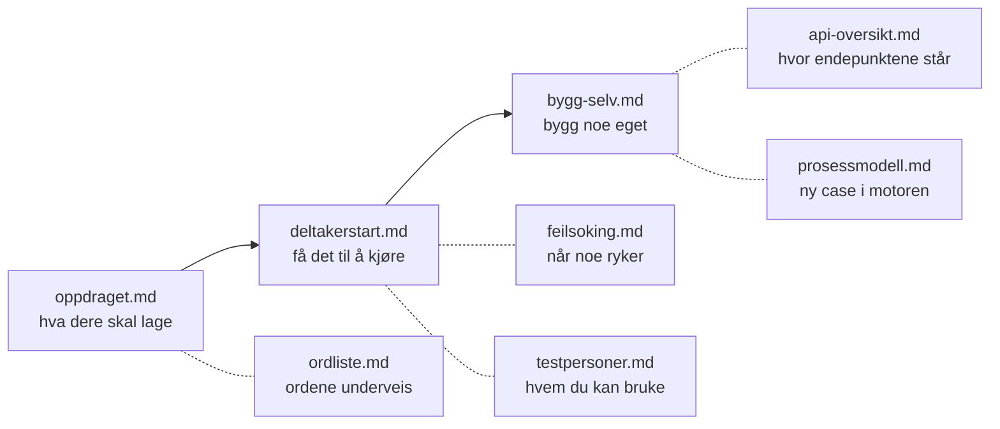

# Dokumentasjon

Alt som er skrevet om sandkassen ligger her. Denne siden er kartet, så du slipper å
gjette hvilken fil som svarer på spørsmålet ditt.

Kjører sandkassen alt? Da er <http://localhost:3001> det andre kartet: det viser levende
helsestatus, hvilken testbruker som hører til hvilken case, og en lenke rett inn i
API-utforskeren for hver tjeneste.

## Lesestien

Heltrukket linje er rekkefølgen. Stiplet linje er noe du slår opp når du trenger det,
ikke noe du leser først.

## Er du deltaker? Les disse tre, i rekkefølge

| # | Fil | Hva du får, og hva det koster |
|---|---|---|
| 1 | [`docs/oppdraget.md`](oppdraget.md) | Hva dere skal lage, hva som er gitt og hva som er fritt. To minutter |
| 2 | [`docs/deltakerstart.md`](deltakerstart.md) | Én kommando, URL-ene, hvilken testbruker som hører til hvilken case, ditt første eget API-kall. Den første timen |
| 3 | [`docs/bygg-selv.md`](bygg-selv.md) | Egen frontend på egen port, egne testdata, hva som er frosset. Når demoen kjører og du vil lage noe selv |

Resten av filene er oppslagsverk. Du trenger ingen av dem før du trenger dem.

## Så slår du opp det du trenger

| Du vil | Les |
|---|---|
| Få sandkassen til å kjøre | [`docs/deltakerstart.md`](deltakerstart.md#1-start-sandkassen) |
| Vite hvilken testbruker som passer casen din | [`docs/deltakerstart.md`](deltakerstart.md#3-hvilken-bruker-til-hvilken-case) |
| Skjønne hvorfor noe svarer `401` eller `403` | [`docs/deltakerstart.md`](deltakerstart.md#4-ditt-første-eget-kall), så [`docs/feilsoking.md`](feilsoking.md) |
| Finne ut av noe som ikke virker | [`docs/feilsoking.md`](feilsoking.md) - ett symptom per avsnitt, med årsak og løsning |
| Finne endepunktene | [`docs/api-oversikt.md`](api-oversikt.md) - den sier hvor de står, og forklarer det spesifikasjonene ikke kan forklare selv |
| Se hele flyten som `curl` | [`examples/curl/README.md`](../examples/curl/README.md) |
| Vite hvem som kan logge inn, og hvem som bare er part i saken | [`docs/testpersoner.md`](testpersoner.md) |
| Forstå datagrunnlaget, og hvor grensene går | [`docs/syntetiske-data.md`](syntetiske-data.md) |
| Lage en ny case inne i prosessmotoren | [`docs/prosessmodell.md`](prosessmodell.md) |
| Style frontenden din som resten av KS Digital | [`docs/designsystem.md`](designsystem.md) |
| Vite hva som forlater maskinen din før du demonstrerer | [`docs/sikkerhet-og-personvern.md`](sikkerhet-og-personvern.md) |
| Slå opp et forvaltningsord | [`docs/ordliste.md`](ordliste.md) |

> [!TIP]
> Leter du etter et endepunkt, er <http://localhost:3001/utforsker> raskere enn alle
> filene over. Den viser hver rute med skjema, velger riktig token for deg, og skriver
> ut en `curl` som virker når du limer den inn.

## For deg som vedlikeholder sandkassen

Disse er ikke deltakermateriale, og du trenger dem ikke for å bygge noe.

| Fil | Hva den er |
|---|---|
| [`AGENTS.md`](../AGENTS.md) | Maintainer-dokumentet. Hva som må bevares og hvorfor, og språkregelen hele repoet skrives etter |
| [`CONTRIBUTING.md`](../CONTRIBUTING.md) | Grener, PR-er og når en endring er ferdig |
| [`docs/architecture.md`](architecture.md) | Målbilde, samspillet mellom tjenestene, og de kjente avvikene mellom hvordan sandkassen presenterer seg og hva den gjør |
| [`README.md`](../README.md) | Hele bildet: alle flagg, porter, oppstartsvalg og kjente begrensninger |
| `agents/` | Kontrakter for agent-skills. Engelsk, og ikke en del av dokumentasjonen over |
