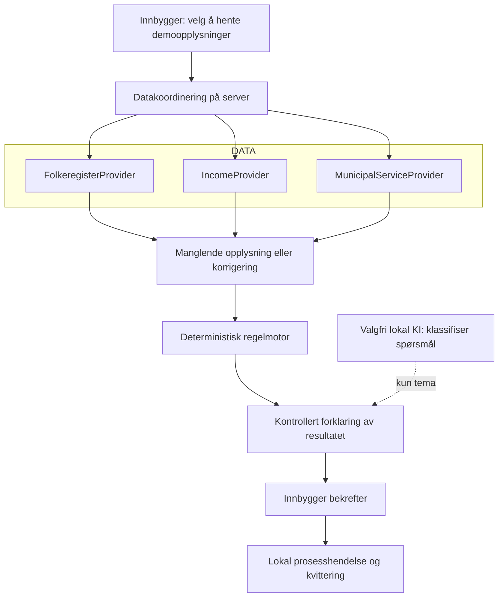

# Arkitektur

Søk én gang er én Next.js-applikasjon med en avgrenset, serverstyrt SFO-flyt.
Arkitekturen skiller data, regler, forklaring og prosess.

## Flyt



Presentasjonsklar versjon: [SVG-diagram](../public/architecture.svg).
Mulig produksjonskobling: Fiks Folkeregister, Fiks skatt og inntekt, kommunalt
oppvekstsystem og kommunal prosess/Prosessbygger. Disse er **ikke tilkoblet**.

## Hvem eier hva?

| Ansvar | Implementasjon | Grense |
|---|---|---|
| Brukerreise | `src/components/citizen-journey.tsx` | Sender svar, aldri ferdig beslutning |
| Datakilder | `src/providers/contracts.ts` | Domenegrensesnitt, ikke påståtte Fiks-kontrakter |
| Testdata | `src/providers/mock-providers.ts` | Alle oppslag er eksplisitt syntetiske |
| Regler | `src/domain/rules.ts` | Ren funksjon uten IO eller modellkall |
| Økt/prosess | `src/server/case-service.ts` | Bevarer kilder, validerer før bekreftelse |
| Forklaring | `src/server/explanation-service.ts` | Tema og kontrollert tekst, ingen beslutningsmyndighet |
| HTTP-grenser | `src/server/http.ts`, `src/app/api/` | Validering, opprinnelsessjekk, HttpOnly-økt |

## Datamodell

`CitizenData` består av tre `Sourced<T>`-verdier: familie, SFO-plass og årsinntekt.
Hver kilde har navn, detaljbeskrivelse, faktisk hentetid i demoen, gyldig periode,
formål og type. Hentetid betyr når den lokale filen ble lest; dataåret er separat.

`Answers` inneholder husholdningsbekreftelse, eventuell ny inntekt, type endring og
merknad. Svarene erstattes når innbyggeren gjør en ny kontroll; originaldata endres ikke.
Innsendt fritekst må være syntetisk og vises som tekst, aldri som HTML.

`Assessment` har status `missing`, `manual`, `eligible`, `no-reduction` eller
`out-of-scope`, regelversjon, begrunnelse og eventuell beregning. `Receipt` oppstår først
etter en eksplisitt bekreftelse og en ny serverberegning. Den har en tilfeldig
demoreferanse og `synthetic: true`.

## Beregningsmodell

Vi bruker en avgrenset illustrasjon av SFO på 1.–4. trinn. Se
[Udirs veiledning](https://www.udir.no/regelverk-og-tilsyn/skole-og-opplaring/rundskriv-om-skolefritidsordninga/finansiering-av-skolefritidsordninga/)
for regelgrunnlaget. **Dette er ikke en komplett implementasjon av regelverket.**

For den syntetiske plassen:

```text
Årspris før gratisandel:           4 500 × 11 = 49 500 kr
Inntektsbegrensning:             612 000 × 6 % = 36 720 kr
Laveste beløp:                                 36 720 kr
Demofordeling etter 12 gratistimer:        (25 − 12) / 25
Foreløpig månedspris:            36 720 × 13 / 25 / 11
Avrundet til øre:                             1 735,85 kr
Mat, separat:                                  250,00 kr
Sum per betalingsmåned:                       1 985,85 kr
```

Pris før inntektsreduksjon, men etter gratisandel, er 2 340 kr. Forskjellen er 604,15 kr
per betalingsmåned. Fordeling per time er en **demoforutsetning**, ikke en universell
nasjonal prismodell. Beregningen bruker heltallsøre og avrunder først månedsbeløpet.
Den fastsetter ikke virkningsdato eller etterbetaling.

Et avvik i husholdning eller SFO-plass stopper prisanslaget. Innbyggeroppgitt inntekt
kan gi et tydelig merket anslag, men alltid manuell behandling. Høy inntekt gir ingen
ekstra inntektsreduksjon; det er ingen avslagstekst på andre støtteordninger.

## HTTP-kontrakt for denne appen

| Metode og rute | Handling |
|---|---|
| POST `/api/case` | Hent valgt lokalt scenario etter `allowed: true` |
| GET `/api/case` | Hent egen økt |
| DELETE `/api/case` | Slett egen økt og informasjonskapsel |
| POST `/api/assessment` | Kontroller svar, beregn på server |
| POST `/api/explanation` | Forklar kontrollert kontekst eller klassifiser spørsmål lokalt |
| POST `/api/confirm` | Krev eksplisitt bekreftelse, beregn på nytt, opprett hendelse én gang |
| GET `/api/receipt` | Last ned bekreftet lokal demokvittering |

Dette er våre egne kontrakter. Arrangørens API-er har andre, norske wire-felt.

## Pålitelighet og kontroll

- Ingen eksterne tjenester i normalflyten. Ingen stille sammenblanding av testdata
  og registerdata. «Datakilden svarer ikke» er et eksplisitt feildemo-scenario.
- Cookie er HttpOnly, SameSite Strict og Secure ved HTTPS. Skrivende forespørsler
  kontrollerer Origin. Dette erstatter ikke eID eller produksjonsautorisering.
- Maksimalt 200 økter. Levetid to timer. Sletting ved neste tilgang/ny økt eller omstart.
- Kvittering er idempotent. En bekreftet økt kan ikke endres videre.
- KI kan returnere bare et tema fra en lukket liste. 2,5 sekunders timeout og maltekst
  ved feil. Selv en feilklassifisering kan ikke endre beløp eller prosess.
- Historikken er begrenset til de siste 100 hendelsene og lever bare i serverminne.

## Utvidelse

Behold domenegrensesnittene, implementer godkjente leverandører og legg til
kontraktstester. Barnehage trenger egne regler. Innlogging, database, journalføring,
vedtak, klage, informasjonssikkerhet og faglig godkjenning er arbeid før pilot,
beskrevet i [integrasjonsnotatet](integrations.md).
