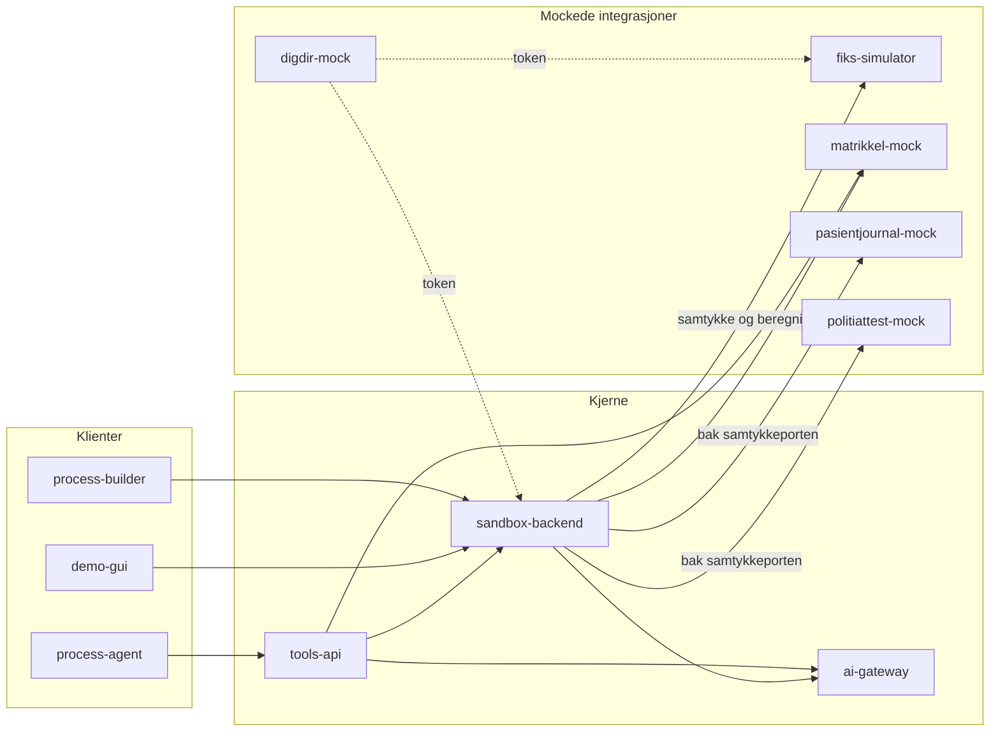

# Arkitektur

## Innhold

- [Målbilde](#målbilde)
- [Arkitekturprinsipper](#arkitekturprinsipper)
- [Autonomi og støtte](#autonomi-og-støtte)
- [Samspill mellom tjenestene](#samspill-mellom-tjenestene)
- [Dynamisk verktøyoppdagelse i agenten](#dynamisk-verktøyoppdagelse-i-agenten)
- [Utskiftbarhet](#utskiftbarhet)
- [Status og kjente avvik](#status-og-kjente-avvik)
- [Neste steg](#neste-steg)

## Målbilde

Tjenestene, portene og rollene deres står **ett sted**:
`apps/shared/tjenester.json`. Dashboardet på <http://localhost:3001> og
API-utforskeren leser den filen, og `pnpm test:openapi` holder den i takt med koden.
Denne siden gjentar den ikke.

Delingen gir en samarbeidsvennlig struktur der flere team kan jobbe parallelt uten å
blokkere hverandre.

## Arkitekturprinsipper

1. Bruk bare syntetiske data
2. Bygg API-et før grensesnittet
3. Logg all datatilgang, som standard og ikke som tilvalg
4. Håndhev policyer i kode, og dokumenter dem der de håndheves
5. La KI formulere - aldri beregne eller avgjøre
6. Hold lokal kjøring enkel: `docker compose up` skal være nok
7. Hold strukturen åpen for utvidelse uten å endre kjernen
8. Velg det som lærer bort mest, foran det som ligner mest på produksjon

## Autonomi og støtte

Hackathonet skal balansere to hensyn:

- teamene skal ha frihet til å velge egne løsningsgrep
- sandkassen skal gi nok støtte til at teamene rekker å produsere en fungerende prototype

Derfor skiller vi mellom:

### Kapabiliteter som bør være felles

- API-er for data, samtykke, KI-støtte, oppgaver og revisjon
- syntetiske datasett
- policyer
- OpenAPI og eksempelkall

### Ting teamene bør kunne velge selv

- frontend-rammeverk
- hvordan de modellerer brukeropplevelsen
- om de bruker vår referanse-GUI eller lager sin egen
- om de bruker vår enkle prosessmodell, Altinn Studio senere, eller en adapter

### Ting vi tilbyr som støtte, ikke krav

- `demo-gui`
- `process-builder`
- eksempelprosesser
- eksempeldatasett

Disse finnes for å senke terskelen og spare tid, ikke for å definere én riktig måte å bygge på.

## Samspill mellom tjenestene

1. `process-builder` viser prosesser via `sandbox-backend`
2. `demo-gui` henter prosessdefinisjon fra `sandbox-backend` og renderer steg dynamisk
3. `sandbox-backend` henter samtykkestatus fra `fiks-simulator`
4. `sandbox-backend` blokkerer inntektsdata uten gyldig samtykke
5. `sandbox-backend` kaller `ai-gateway` for oppsummering og forklaring
6. `sandbox-backend` henter matrikkeldata fra `matrikkel-mock` over HTTP (`MATRIKKEL_BASE_URL`, se `apps/sandbox-backend/src/matrikkel.ts`) og eksponerer dem via `GET /api/matrikkel/gater` og `SJEKK`-steg. Mocken er eneste leser av seeden, og eneste vei til SOAP-flaten
7. `sandbox-backend` henter legeerklæringen fra `pasientjournal-mock` over HTTP (`PASIENTJOURNAL_BASE_URL`), bak samtykkeporten. Mocken er eneste leser av `data/legeerklaeringer.json`, og integrasjonen finnes ikke i virkeligheten - se `apps/pasientjournal-mock/README.md`
8. `sandbox-backend` leser politiattesten fra `politiattest-mock` over HTTP (`POLITIATTEST_BASE_URL`), bak samtykkeporten, og minimerer svaret før noe annet ser det: type, dato og antall anmerkninger, aldri hva de gjelder. Mocken er eneste leser av `data/politiattester.json`, og integrasjonen finnes ikke i virkeligheten - se `apps/politiattest-mock/README.md`
9. `tools-api` eksponerer verktøy mot backend, ai-gateway og matrikkel-mock
10. `process-agent` bruker `tools-api` for all tilstand og data; oppdager relevante verktøy dynamisk per steg via `suggest_step_tools`
11. alle relevante hendelser sendes til revisjonslogg

Tegnet opp, med samtykkeporten markert:

Pilene er hvem som kaller hvem. `digdir-mock` står for seg fordi den ikke kalles inn i
en flyt: den utsteder tokenet `sandbox-backend` og `fiks-simulator` krever.

## Dynamisk verktøyoppdagelse i agenten

Når agenten møter et `QUESTION`-steg kaller den `suggest_step_tools` i `tools-api`.
Dette kallet sender stegdefinisjonens tekst og feltlabeler til `ai-gateway /ai/velg-verktoy`,
som returnerer hvilke verktøy som er relevante (`kontekst`, `validering` eller begge).
Agenten kjører så `kontekst`-verktøy proaktivt og bruker `validering`-verktøy til å normalisere
brukerens svar.

Agenten har i tillegg hardkodede snarveier for `fartsdempende-tiltak`: steg-ID-ene
`velg-gate`, `hent-gate`, `boliger-bekreft`, `begrunnelse` og verktøynavnet
`matrikkel_finn_veger`. Den dynamiske oppdagelsen er altså ekte, men ikke enerådende.

## Utskiftbarhet

Vi må unngå å låse oss til dagens referanseverktøy.

Det betyr at:

- `process-builder` skal kunne erstattes av `Altinn Studio` eller lignende senere
- `demo-gui` skal kunne erstattes av teamenes egne klienter
- prosessformat og GUI-logikk bør holdes enkle nok til at vi kan lage adaptere senere
- API-ene er mer viktige enn den interne implementasjonen

## Status og kjente avvik

Alle elleve tjenestene er implementert og kjører. Samtykkesperre, revisjonslogg,
deterministisk vilkårsvurdering og sju demo-case er på plass. Det som følger er
avvik mellom hvordan sandkassen presenterer seg og hva den faktisk gjør - verdt å
kjenne til før du bygger på den.

**KI-fallback er delvis synlig.** Når modellen ikke svarer, faller `ai-gateway` tilbake
til maltekst og setter et `advarsel`-felt. `GET /helse` rapporterer `modellNaaBar`, og
begge GUI-ene viser en gul stripe ved sidelast hvis modellen er nede. `/chat` viser i
tillegg `advarsel` per svar - men bare for resultater som kommer via backend (i praksis
`SUMMARY`). `advarsel` fra `/ai/tolk-svar` vises ikke. Verifiser med
`POST /ai/klarsprak` - svaret skal ha `modell: "ollama:<navn>"` og ingen `advarsel`.

**Modellkall har timeout.** `AI_TIMEOUT_MS` (default 180000) avbryter og faller tilbake
i stedet for å henge. Merk at `modellNaaBar` for `openrouter` og `bedrock` bare sjekker
at nøkler finnes - den sonderer ikke tjenesten, så en feil nøkkel eller en modell IAM-
policyen ikke tillater rapporteres som tilgjengelig og feiler først på neste kall. For
`bedrock` sjekkes først at AWS-SDK-en lar seg laste, siden den lastes lat: mangler
pakken, er nøklene uinteressante, og `feil` peker på `pnpm install` i stedet.

**Provider byttes i en kjørende container.** `apps/ai-gateway`'s `GET /admin` bytter
mellom `mock`/`ollama`/`openrouter`/`bedrock` (og Bedrock-modell) uten restart, lagret
i `state/ai-provider-override.json`. `AI_PROVIDER` i miljøet er bare startverdien.

**Alle modellkall spores.** `state/ai-trace.jsonl` får én linje per kall med prompt,
svar, modell og varighet. Les på `GET /trace` eller `GET /trace.json`
(`?sporingsId=`, `?task=`, `?limit=`). Dette er raskeste vei til å se hva modellen
faktisk fikk, før heuristikk og validering rørte det.

**Prosessmotoren er lineær.** `stegIndex` teller oppover; ingen forgrening, ingen
betinget hopping. Det er et bevisst enkelt utgangspunkt, ikke en mangel som må
lukkes før hackathonet.

**Agent-sesjoner ligger i minnet** i `process-agent`, uten TTL eller opprydding.
De forsvinner ved omstart.

**Autentisering går gjennom `digdir-mock`.** Både sandbox-backend og
fiks-simulator krever token: ID-porten for en innbygger, Maskinporten for en
maskin, med audience per tjeneste. `personId` tas ikke lenger fra requesten på
tro og love - tokenets `pid` må slå opp til den personen forespørselen gjelder.
Utstederen er en etterlikning, og klientassertionen verifiseres ikke, så
identitetslaget er ekte i form og syntetisk i tillit.

**Hele `fiks-simulator` er bak Maskinporten, med ett scope per flate.**
`ks:fiks:register`, `ks:fiks:folkeregister`, `ks:fiks:svarut`, `ks:fiks:samtykke`,
`ks:fiks:oppgave` og `ks:fiks:melding` - scopet *er* hjemmelen, så et
oppgave-scope åpner ikke samtykkeflaten, og et register-scope åpner ikke
Folkeregisteret eller SvarUt. Folkeregisterflaten
snevrer i tillegg inn *innenfor* scopet: rolleId-en i stien avgjør hvilke
informasjonsdeler som kommer ut, og en del utenfor rollen er et 403-avslag -
dataminimering som API-adferd. Token-kravet på samtykke- og
oppgaveflatene er ikke pynt: uten det kunne samtykkesperren `sandbox-backend`
håndhever så nøye - pid-binding, ressurskatalog, formål hentet fra samtykket - vært
tilfredsstilt med to uautentiserte kall mot 8081.

Innbyggerens eget ID-porten-token avvises på alle seks flatene med `403
KREVER_MASKINPORTEN`. Det er ikke en forenkling: et samtykke *spørres om* av en
kommune og svares gjennom den. `sandbox-backend` holder det verifiserte
innbyggertokenet, avgjør, og navngir innbyggeren i `aktor` på vei ut - hjemmelen er
maskinens, handlingen er innbyggerens. `pnpm test:samtykke` pinner begge
avvisningene.

---

## Neste steg

**Skal du bygge på sandkassen i stedet for i den?**
[`docs/bygg-selv.md`](bygg-selv.md) er siden for det.

**Skal du endre selve sandkassen?** [`AGENTS.md`](../AGENTS.md) er
maintainer-dokumentet, og [`CONTRIBUTING.md`](../CONTRIBUTING.md) sier når en endring
er ferdig.

**Tilbake til kartet:** [`docs/README.md`](README.md).
