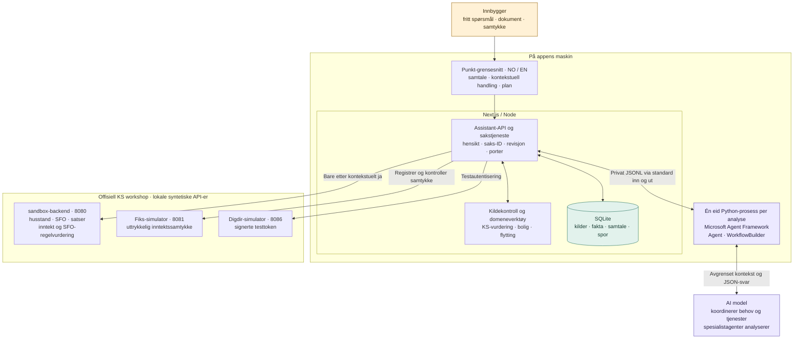
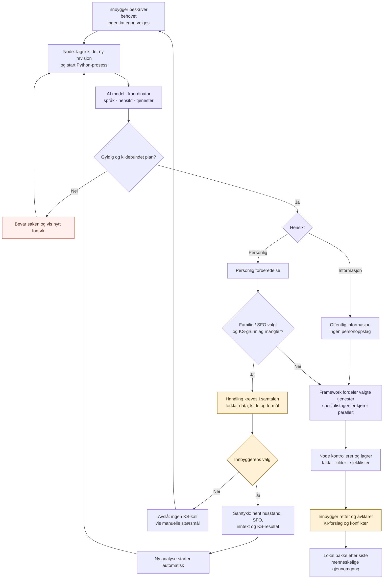
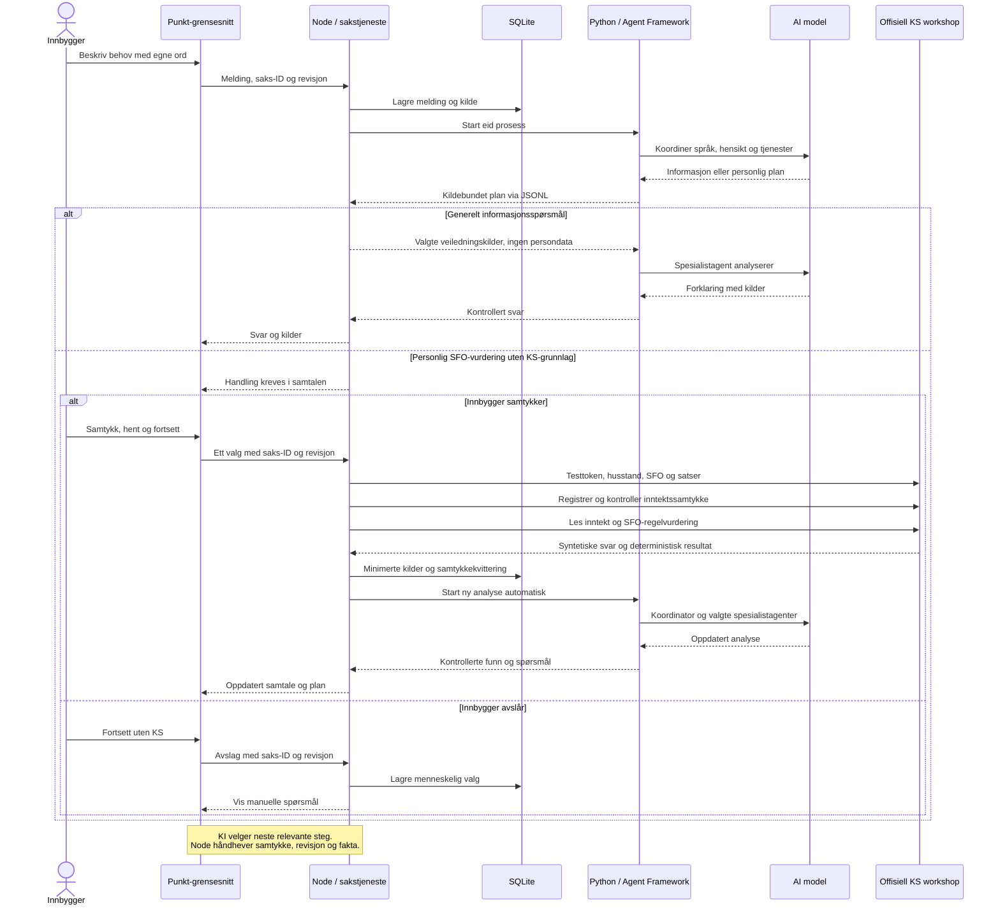
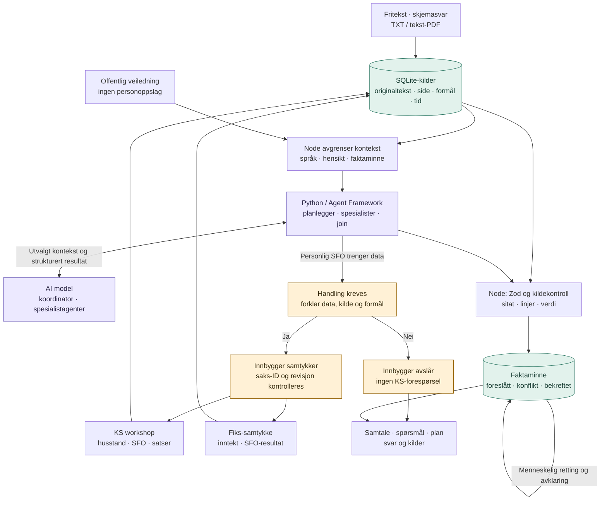
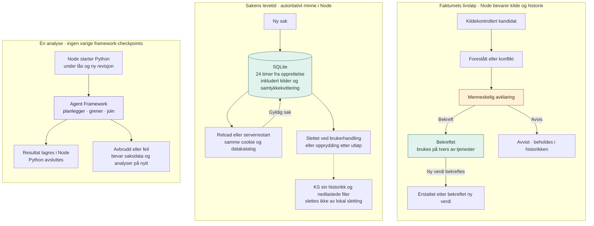

# Diagrammer / Diagrams

[Norsk README](../../README.md) · [English README](../../README.en.md) · [Arkitektur / Architecture (NO)](../agentic-architecture.md)

Diagrammene bruker norske etiketter. Overskrifter og sammendrag finnes også på engelsk.
GitHub viser Mermaid-blokkene direkte i forhåndsvisningen av denne Markdown-filen.

The diagrams use Norwegian labels, with bilingual headings and summaries.
GitHub renders the Mermaid blocks in this Markdown file’s preview; see
[GitHub’s diagram documentation](https://docs.github.com/en/get-started/writing-on-github/working-with-advanced-formatting/creating-diagrams).

Mermaid-kildefilene i denne mappen er redigeringsgrunnlaget. Ved endringer må den
tilsvarende blokken nedenfor oppdateres. PNG/SVG-versjoner for appen lages med
[`npm run diagrams:render`](../../scripts/render-diagrams.mjs).

The Mermaid source files in this directory are the editable originals. When changing
one, update its matching block below. Use [`npm run diagrams:render`](../../scripts/render-diagrams.mjs)
to refresh the app’s PNG/SVG versions.

## Arkitektur / Architecture

Ansvar og systemgrenser. / Responsibilities and system boundaries.

[Kilde / Source](agentic-architecture.mmd) · [SVG](../../public/diagrams/agentic-architecture.svg)

## Arbeidsflyt / Workflow

Fra spørsmål til gjennomgått plan. / From a question to a reviewed plan.

[Kilde / Source](agentic-workflow.mmd) · [SVG](../../public/diagrams/agentic-workflow.svg)

## Sekvens / Sequence

Samspill mellom innbygger, app og tjenester. / Interaction between the citizen, app and services.

[Kilde / Source](agentic-sequence.mmd) · [SVG](../../public/diagrams/agentic-sequence.svg)

## Dataflyt / Data flow

Kilder, modellkontekst og bekreftelse av fakta. / Sources, model context and fact confirmation.

[Kilde / Source](agentic-data-flow.mmd) · [SVG](../../public/diagrams/agentic-data-flow.svg)

## Livsløp / Lifecycle

Fakta, sakslagring og analyseforløp. / Facts, case storage and analysis runs.

[Kilde / Source](agentic-lifecycle.mmd) · [SVG](../../public/diagrams/agentic-lifecycle.svg)

